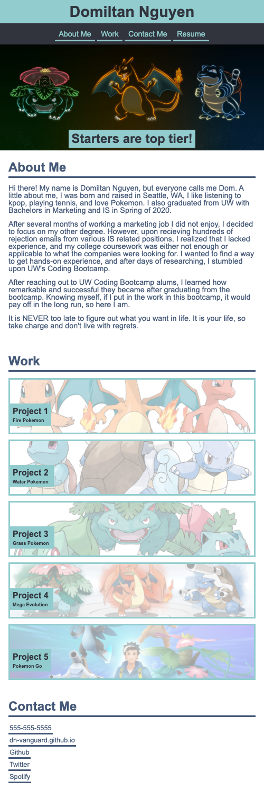

# Dom Nguyen's Portfolio
<h2>HW-02</h2>

## What was your motivation?
- I saw that many web developers show off their work through an online portfolio of some kind.
- This made me realize that in order to succeed in this field, I need to focus and build things that people would want to hire me for.

## Why did I build this project?
- Similar to my motivation, I wanted to stand out, and show the public the materials I have worked on from raw code.

## What problem does it solve?
- For me personally, I learned that creating a website from scratch takes hard work, and doing this allowed me to truly understand CSS.
- I was stuck with CSS for quite a while so doing this allowed me create a basic outline for a portfolio and eventually updating it with many other projects in the future.
- Flexbox was also a huge milestone for me to master and it allowed me to truly grasp and good understanding of it.

## What did I learn?
- I learned flexbox, display, and especially @media screen.
- I knew that many business make websites optimized for both web and mobile view, so learning this skill makes me admire software developers that much more.

## Link to URL
https://dn-vanguard.github.io/

## Screenshots

